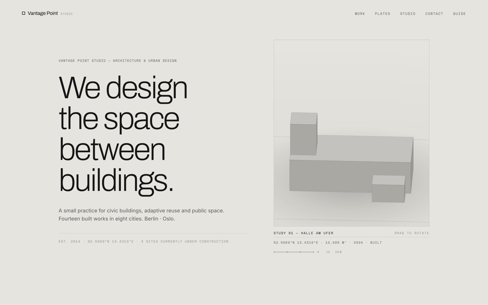

<!-- parable:beautified -->
<div align="center">

<h1>Vantage Point</h1>

<p><strong>Architecture portfolio — morphing three.js massing models.</strong></p>

<p>
  <a href="https://bswxyz.github.io/vantage-point-studio/"></a>
  
  
  <a href="LICENSE"></a>
</p>

<p>
  <a href="https://bswxyz.github.io/vantage-point-studio/"><b>Live demo</b></a>
  &nbsp;·&nbsp;
  <a href="https://bswxyz.github.io/vantage-point-studio/guide/">Build notes</a>
  &nbsp;·&nbsp;
  <a href="https://parable-three.vercel.app/templates">More templates</a>
</p>

<a href="https://bswxyz.github.io/vantage-point-studio/">
  
</a>

</div>

**Use this template** — copy the source into a new project:

```bash
npx degit bswxyz/vantage-point-studio my-app
```


An architecture & urban-design portfolio with no photography — the work is argued with a
procedural three.js massing model and authored SVG drawings. The light-theme counterweight in
the [Parable 25 design showcase](https://parable-three.vercel.app).

---

## The concept

Vantage Point Studio is a small (fictional) practice for civic buildings, adaptive reuse and
public space — "we design the space between buildings." Real studios of this kind argue with
drawings before photographs, so the site does too: the hero is an abstract white massing study
turning slowly on warm concrete; the project index is pure typography, and hovering a row
rebuilds the model into that project's volume composition; the gallery is a drag-strip archive
of plan/section plates drawn in SVG. Spare voice, huge whitespace, thin rules, one sienna accent.

## Design system

- **Palette (warm concrete, light):**
  `--bg:#e6e4df` concrete · `--bg-2:#dcdad4` recessed · `--paper:#edece7` plate paper ·
  `--ink:#161616` · `--dim:#5a5a56` · `--faint:#8f8d87` · `--sienna:#b5451f` the single accent ·
  `--line:rgba(22,22,22,.12)`. Sienna appears exactly four ways: kickers, the active index
  numeral, north arrows, and new-work lines on the plates (the real drafting convention —
  new construction is drawn in red).
- **Type:** `Archivo` 200–400 (thin refined grotesque display, tight tracking) · `Inter`
  (body) · `Space Mono` (coordinates, areas, years, plate numbers — every fact is set in mono,
  like a drawing's title block).
- **Signature motion:** a "drafting-machine" ease `cubic-bezier(.55,.06,.13,.96)` — decisive
  start, precise settle, nothing bounces. Clipped-line hero intro, opacity-only row states,
  quint-out volume morphs with a 45 ms stagger.
- **Why it fits:** stark light minimalism is the argument. A practice that designs "the space
  between buildings" gets a site that is mostly space; the model is the brightest object on the
  page and everything else is a hairline.

## Stack

- **Plain HTML / CSS / vanilla JS.** No framework, no build step.
- **[three.js 0.160](https://threejs.org/)** via an import map + a guarded dynamic
  `import('three')` — used for one orthographic scene: a pool of eight unit cubes with
  `EdgesGeometry` outlines, a canvas-gradient contact shadow, and a hairline site boundary.
  No WebGL / reduced motion / failed CDN → a static SVG axonometric already in the markup.
- **Authored inline SVG** for the six plates (plans, sections, a site plan) — a five-stroke
  drawing vocabulary (wall / thin / faint / dashed / poché) styled from the page's CSS tokens.

## Running it locally

No install. Any static server works because all paths are relative:

```bash
git clone https://github.com/bswxyz/vantage-point-studio
cd vantage-point-studio
python3 -m http.server 8840      # or: npx serve .
# open http://localhost:8840
```

There is nothing to build. Edit `index.html` / `styles.css` / `main.js` and refresh.

## Structure

```
index.html          the page — semantic sections, six SVG plates, the SVG axon fallback
styles.css          all styling — design tokens live in :root at the very top
main.js             massing scene + morphs, index hover-swap, drag gallery, counters, reveals
guide/index.html    the "how it was built" write-up (self-contained, styled to match)
.nojekyll           tells GitHub Pages to serve files as-is
```

The massing compositions live in `main.js` under `PROJECTS` — each project is an array of
`[cx, cz, w, d, h, yBase]` volumes on an abstract 8×8 plot. Add a project by adding a row to
the index in `index.html` and a composition here.

## Demo vs. real — what a production version would need

This is an intentionally-scoped demo. What's **fictional/static** today:

- **The practice is invented.** Projects, awards, coordinates, addresses, team and counters are
  authored fiction; a real studio would wire these to a CMS (projects as structured content:
  facts, drawings, credits) instead of hand-edited HTML.
- **No case-study pages.** Each index row would open a project page — full drawing sets, process,
  credits, press. The index/viewer pattern here is the navigation for that, not a replacement.
- **No real photography.** Built work eventually needs commissioned photographs; the massing
  model and plates would become the *complement* to photography, not the substitute.
- **The massing studies are illustrative** — real compositions would be exported from the
  practice's actual models (IFC/OBJ → simplified volumes), not authored by hand in JS.
- **No practice plumbing.** Contact form/CRM, news, careers, localisation (DE/NO), and analytics
  are all out of scope.

What's **real** and reusable as-is: the pooled-cube morphing viewer with its fallback chain,
the hover/focus-swap index pattern, the SVG plate vocabulary, the drag gallery with keyboard
support, and the full responsive / reduced-motion / focus-visible layer.

## License

[MIT](LICENSE). Design & build by **Parable**. No photo assets — everything
on the page is code: WebGL, SVG, and type.
